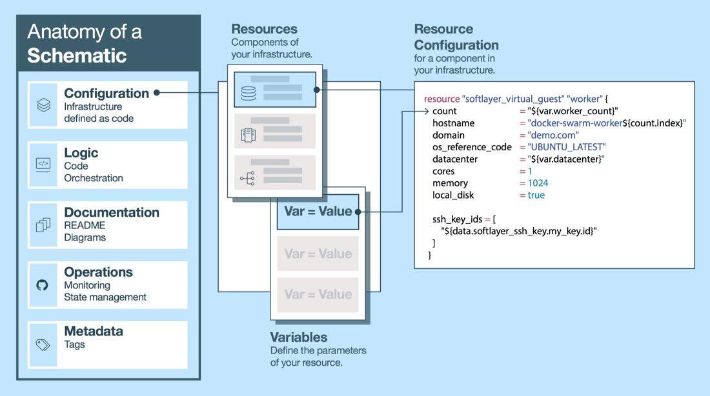
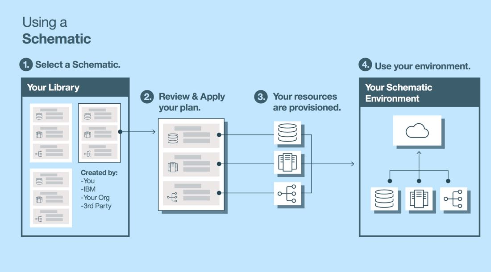

# IBM Bluemix Schematics Service On-boarding
An on-boarding kit for the IBM Bluemix Schematics service.

<!-- START doctoc generated TOC please keep comment here to allow auto update -->
<!-- DON'T EDIT THIS SECTION, INSTEAD RE-RUN doctoc TO UPDATE -->
## Table of Contents
- [Introduction](#introduction)
- [Video of Terraform Execution](#video-of-terraform-execution)
- [Terminology](#terminology)
- [Early Access](#early-access)
- [Sponsor Users](#sponsor-users)
  - [Communication and Collaboration](#communication-and-collaboration)
  - [Support & Feedback Loops](#support--feedback-loops)
- [Getting Started](#getting-started)
  - [Prerequisites](#prerequisites)
  - [Install IBM Cloud Terraform](#install-ibm-cloud-terraform)
    - [OSX](#osx)
    - [Linux](#linux)
  - [Create Cloud Resources using Terraform](#create-cloud-resources-using-terraform)
- [Examples](#examples)
  - [Schematics](#schematics)
  - [Modules](#modules)

<!-- END doctoc generated TOC please keep comment here to allow auto update -->

# Introduction
Modern cloud infrastructure ranges from bare metal servers, to virtual machines, to containers, to managed services, to SaaS, to PaaS, and beyond.  Many times that infrastructure spans multiple data centers, companies, products, and regions around the world. Modern infrastructure is cloud native and global scale.

IBM Cloud Schematics gives architects, developers, and operators the ability to define and manage their modern cloud infrastructure as a single unit, across any number of environments, in an automated and repeatable fashion. In traditional operations developers and operators provision infrastructure and services using multiple and fragmented components and tools in a manual and repetitive manner which severely limits reproducibility, transparency, and codification. This obscures the “how” and “why” of infrastructure choices and changes which limits usage, delays time to value, and impedes ecosystem expansion.

IBM Cloud Schematics uses HashiCorp's [Terraform](https://www.terraform.io/) under the hood. Schematic Modules and Configurations are written in [HashiCorp Configuration Language](https://www.terraform.io/docs/configuration/syntax.html).

IBM Cloud Schematics allows users to define their infrastructure in files that can be checked into source control, which enables versioning, commit messages that can reveal the reason behind a change, an audit trail to determine who changed what and when, and collaboration, review, and transparency when working on infrastructure as a team.

IBM Cloud Schematics gives IBM a way to offer infrastructure building blocks to its customers, as well as complete and prescriptive solutions. Customers can more quickly build solutions for the platform, understand how to build those solutions, and better grasp how the platform products and offerings can be put together to create solutions.

IBM Cloud Schematics further enables teams and companies to build up a library of componentry that can be reused again and again to net the same results.  From tiny building blocks to complete solutions. Need a hadoop cluster? There is a module to do that, just plug in your variables! This allows cross-team and cross-organization code reuse and ensures that the company is working to solve problems as a unit and solving them in the best way possible.

  
[High Resolution available here](anatomy-schematic.png)  

  
[High Resolution available here](using-schematic.png)  

# Video of Terraform Execution

[Click here to watch a video of Terraform Plan, Apply, and Destroy](https://youtu.be/vTKeWTfalTU)

# Terminology
- **IBM Cloud Schematics** - The service overlay that enables teams to more easily and safely take advantage of Terraform with IBM Bluemix.
- **[Infrastructure as code (IaC)](https://en.wikipedia.org/wiki/Infrastructure_as_Code)** - which encapsulates all cloud resources. These can be any IaaS component such as baremetal servers, virtual machines, containers, load balancers, software defined networking components, etc; SaaS offerings such as watson services, message hub (message queue), etc; or PaaS offerings such as D(ata)B(ase)aaS, functions as a service (OpenWhisk), etc.
- **[Terraform](https://www.terraform.io/)** - The underlying IaC engine used by IBM Cloud Schematics.
- **Schematic** - is another term for a [Terrform Configuration](https://www.terraform.io/docs/configuration/index.html) which is a collection of Terraform files which defines the infrastructure as code.
  - [An Example can be found here: github.com/tf-bluemix-loadbalanced-nginx ](https://github.com/ckelner/tf-bluemix-loadbalanced-nginx)
- **[Modules](https://www.terraform.io/docs/modules/index.html)** - A special reusable configuration that is often used as a building block that encapsulates a certain functionality. Used in both configurations and by other modules. A configuration or module can include _N_ modules.
  - [An Example can be found here: github.com/tf_ibmcloud_local_loadbalancer ](https://github.com/ckelner/tf_ibmcloud_local_loadbalancer)
- **[Configuration Management](https://www.terraform.io/intro/vs/chef-puppet.html)** - tools that install and manage software on any number of resources (baremetal and virtual servers, containers, etc)

# Terraform Documentation & Resources Supported

[Click here for the temporary Terraform documentation](http://ibmcloudterraformdocs.chriskelner.com/docs/providers/ibmcloud/index.html)

# Early Access
Currently the service itself is not available (as of April 06 2017). Early access involves using [Terraform](https://www.terraform.io/) from a users local machine. You must be a "[Sponser User](#sponser-users)" to gain early access.

# Sponsor Users
IBM Cloud Schematics will invite companies to be sponsor users; The sponsor user program at IBM creates a partnership between the two companies which will have the two work closely so that IBM can solve the sponsor user's problems with the IBM product. It also enables the sponsor user to gain access to the internal progress of the product as well as influence over the direction and roadmap. This involves hands on observation and working sessions with development and operation teams. A more in-depth presentation and discussion will explain the details of what it means to be a sponsor user.

If you are not already a sponsor user, but are interested in becoming one, please contact [ckelner@us.ibm.com](mailto:ckelner@us.ibm.com) with subject line "Schematics Sponsor User" introducing yourself.

See the "[Getting Started](#getting-started)" section for further details on what to do next.

## Communication and Collaboration
- [Slack](https://ibm-blueprint-service.slack.com/signup)
- [GitHub](https://github.com/)
- [Email](mailto:ckelner@us.ibm.com)

## Support & Feedback Loops
- 2-hr on-boarding session (day one)
- 2-hr follow-up working session (day three)
- Ongoing collaboration via Slack, Email, GitHub
- Bi-monthly 1-hr sync sessions (every two weeks)

# Getting Started  
## Prerequisites  
## Install IBM Cloud Terraform  
IBM currently has an independent binary from Terraform core. Currently there are two flavors available, one for linux and one for OSX (both for amd64 architectures). The current version is based on terraform `0.9.1`.

Please obtain the password from the IBM Schematics team to access these binaries: [click here to download](https://www.dropbox.com/sh/c18vcjnm5okizcz/AACAqFImsZw3GvQw9knb-ui_a?dl=0).

### OSX
Place the `terraform` binary into `/usr/local/bin`. If you already have `terraform` installed on your system and you want to continue to use it, you'll need to update your `$PATH` environment variable to make `/usr/local/bin` take precedence, OR rename the IBM Cloud terraform binary to something else (e.g. `ibm-cloud-tf`). If you decide to update `$PATH` you can simply add `export PATH=/usr/local/bin:/usr/local/sbin:/opt/local/bin:/opt/local/sbin:$PATH` to your `~/.bashrc` or `~/.profile` (if those files don't exist you can create them) and open a new terminal to take effect.

### Linux
Place the `terraform` binary into `/usr/local/`. If you already have `terraform` installed on your system and you want to continue to use it rename the IBM Cloud terraform binary to something else (e.g. `ibm-cloud-tf`).

## Create Cloud Resources using Terraform

Navigate to [https://github.com/IBM-Bluemix/tf-single-vm](https://github.com/IBM-Bluemix/tf-single-vm) and follow the directions in the README. It will guide you through setting up your credentials and executing Terraform to create running resources from the configuration.

# Examples  
## Schematics  
- [tf-single-vm](https://github.com/IBM-Bluemix/tf-single-vm)
- [tf-bluemix-loadbalanced-nginx](https://github.com/ckelner/tf-bluemix-loadbalanced-nginx)

## Modules  
- [tf_ibmcloud_local_loadbalancer](https://github.com/ckelner/tf_ibmcloud_local_loadbalancer)
